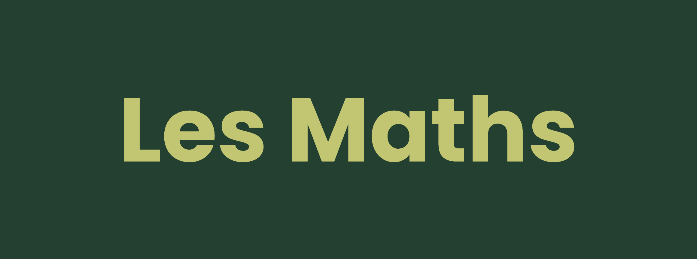

# Les Maths 

✖️ Cours de maths gratuits en francais 🇫🇷

Ce cours est inspiré des cours de préparation au DAEUB de [Maxime Mikolajczak](https://www.youtube.com/watch?v=q9lRWN0_ReI&list=PLPL7pmz6P850S1DWiqgpX3z-ymHfus6Ql) et est rédigé par Léopold Ibghy Koprivnik Aka [SkwalExe](https://github.com/SkwalExe)

# Sommaire 📚

P0.01 - [Les prioriétés opératoires](cours/les-priorites-operatoires)

P0.01 - [Les calculs astucieux💡](cours/les-calculs-astucieux)

P0.02 - [Fractions égales entre elles](cours/fractions-egales-entre-elles)

P0.02 - [Réduction de fractions](cours/reduction-de-fractions)

P0.02 - [Addition et soustraction de fractions](cours/addition-et-soustraction-de-fractions)

P0.02 - [Multiplication de fractions](cours/multiplication-de-fractions)

P0.02 - [Division de fractions](cours/division-de-fractions)

# Des questions ?

### **Vous pouvez ouvrir l'onglet discussion 💬 en haut de l'ecran**

# final

SI vous avez des problemes, n'hesitez pas a ouvrire une issue.

# Contributions

Les pull requests sont les bienvenues, pour des changements majeurs, merci d'ouvrire une issue pour expliquer ce que vous voulez changer. 

